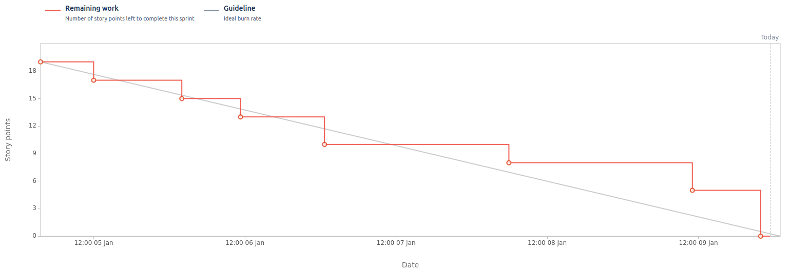

# Sprint 7

**From**: 2024/12/28
**To**: 2025/01/04

**Scrum Master**: Tiago Gomes

**Product Owner**: Sara Almeida

**Developers**: Mariana Perna, Roberto Castro

## Sprint Goal

The goal for this sprint is to implement key notification features for both landlords and tenants, such as pending expenses, contract uploads, and issues. Additionally, we aim to develop the functionality of automating expense division and enabling tenants to mark expenses as paid. The sprint also includes concluding the CD pipeline to streamline deployments.

| Expected     | Quantity |
| ------------ | -------- |
| Stories      | 7        |
| Tasks        | 2        |
| Bug          | 1        |
| Epics        | 2        |
| Story Points | 19       |

## Sprint Backlog

| Issues (SCRUM-\*)| Description                                  | Assignee          | State | 
| ---------------  | --------------------------------------------- | ---------------    | ----- | 
| SCRUM-103         | CD Pipeline               | Mariana Perna      | To Do  |
| SCRUM-37         | Notify After Contract Upload    | Tiago Gomes       | Done  |
| SCRUM-147         | Hotfix - Updae Tenant addition logic        | Sara Almeida     | Done  |
| SCRUM-38        | Notify the Tenant of a pending Expense        | Tiago Gomes     | Done  |
| SCRUM-36        | Notify the Landlord of an Issue        | Tiago Gomes     | Done  |
| SCRUM-135         | Tenant marks expense as paid        | Sara Almeida     | Done  |
| SCRUM-36        | Notify the Landlord of Completed Payment        | Tiago Gomes     | Done  |
| SCRUM-30         | Automatic Division of Expenses        | Mariana Perna     | Done  |
| SCRUM-29         | Tenant View Contract       | Roberto Castro     | Done  |
| SCRUM-148         | Logging Update       | Tiago Gomes     | Done  |

## User Stories

| User Stories  | Description                    | Developer     | State | Story Points |
| --------------| ------------------------------ | ------------- | ----- | ------------ |
| SCRUM-37         | Notify After Contract Upload    | Tiago Gomes       | Done  | 2 |
| SCRUM-38        | Notify the Tenant of a pending Expense        | Tiago Gomes     | Done  | 2 |
| SCRUM-36        | Notify the Landlord of an Issue        | Tiago Gomes     | Done  | 2 |
| SCRUM-135         | Tenant marks expense as paid        | Sara Almeida     | Done  | 3 |
| SCRUM-36        | Notify the Landlord of Completed Payment        | Tiago Gomes     | Done  | 2 |
| SCRUM-30         | Automatic Division of Expenses        | Mariana Perna     | Done  | 3 |
| SCRUM-29         | Tenant View Contract       | Roberto Castro     | Done  | 5 |

## Sprint Review

| Concluded    | Quantity |
| ------------ | -------- |
| Stories      | 7        |
| Tasks        | 2        |
| Bug          | 1        |
| Epics        | 2        |
| Story Points | 19       |

## Sprint Retrospective

Unfortunately, we were unable to achieve full integration of our application's deployment during this sprint. However, we recognize the significant effort the team put in to tackle challenges and meet the sprint goals.

Despite these obstacles, we successfully completed all planned stories, delivering the expected functionalities and ensuring progress aligned with our project roadmap. The team demonstrated excellent collaboration and adaptability, which enabled us to address critical issues efficiently.

The main focus of this sprint, as in the previous one, was deployment. Most of our time was spent configuring and testing the infrastructure. One persistent issue was ensuring that the frontend received the JWT cookie correctly in the deployed environment, which remains unresolved but is a priority moving forward.

Overall, looking back on the entirety of the project, we are proud of the progress we've made. From building robust functionalities to navigating complex deployment challenges, the project has been a valuable learning experience for everyone involved. The team’s dedication and persistence have been instrumental in delivering a solution that aligns with our objectives, even if certain aspects require further refinement.

## Sprint Burndown Chart

