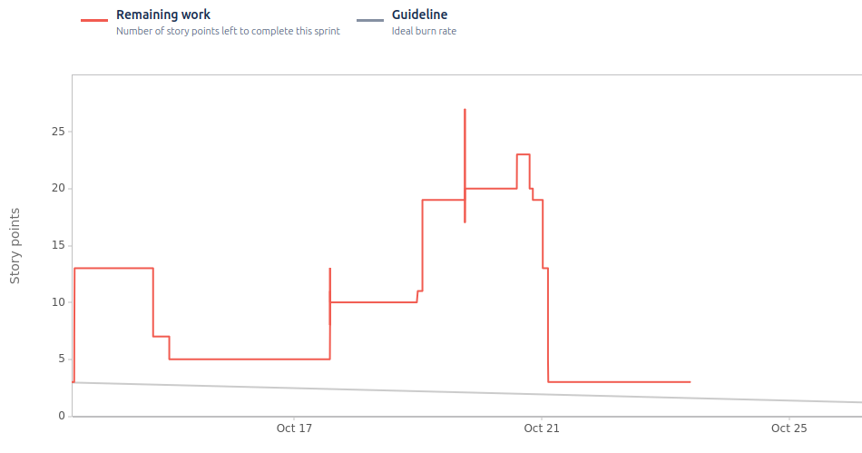

# Sprint 1

**From**: 2024/10/13
**To**: 2024/10/21

**Scrum Master**: Sara Almeida

**Product Owner**: Tiago Gomes

**Developers**: Roberto Castro, Mariana Perna, Rafaela Dias

## Sprint Goal

The main goal for this sprint is to incorporate AWS Cognito IDP with our application and test it. We also aim to learn about AWS services by deploying our frontend and usermicroservice and hosting our DBs.

| Expected     | Quantity |
| ------------ | -------- |
| Tasks        | 22       |
| Epics        | 2        |
| Story Points | 27       |

## Sprint Backlog

| Tasks (SCRUM-*) | Description                             | Developer        | State |
| --------------- | --------------------------------------- | -----------------| ----- |
| SCRUM-8         | User Login                              | Tiago Gomes      | Done  |
| SCRUM-2         | User Registration                       | Sara Almeida     | Done  |
| SCRUM-11        | Landlord Addition of Expenses           | Mariana Perna    | Done  |
| SCRUM-14        | Tenant Landing Page                     | Sara Almeida     | Done  |
| SCRUM-15        | Landlord Landing Page                   | Roberto Castro   | Done  |
| SCRUM-16        | User Profile Page                       | Rafaela Dias     | Done  |
| SCRUM-18        | Deploy User Microservice in AWS ECS     | Tiago Gomes      | Done  |
| SCRUM-20        | Deploy Frontend Container in AWS ECS    | Mariana Perna    | Done  |
| SCRUM-21        | AWS Networking Setup                    | Sara Almeida     | Done  |
| SCRUM-23        | Initial AWS Database Configuration      | Tiago Gomes      | Done  |
| SCRUM-24        | Link Frontend with Backend              | Mariana Perna    | Done  |
| SCRUM-26        | Deploy Landlord Microservice in AWS ECS | Roberto Castro   | Done  |

## User Stories

| User Stories    | Description                   | Developer      | State | Story Points |
| --------------- | ----------------------------- | -------------- | ----- | ------------ |
| SCRUM-5         | User Registration             | Mariana Perna  | Done  | 3            |
| SCRUM-6         | User Login                    | Mariana Perna  | Done  | 3            |
| SCRUM-7         | Landlord Addition of Expenses | Tiago Gomes    | Done  | 6            |
| SCRUM-8         | Tenant Landing Page           | Sara Almeida   | Done  | 3            |
| SCRUM-9         | Landlord Landing Page         | Roberto Castro | Done  | 5            |
| SCRUM-10        | User Profile Page             | Rafaela Dias   | Done  | 3            |
| SCRUM-11        | Deploy User Microservice      | Roberto Castro | Done  | 4            |

Team Velocity: 27

## Sprint Review

| Concluded    | Quantity |
| ------------ | -------- |
| Tasks        | 22       |
| Epics        | 2        |
| Story Points | 27       |

## Sprint Retrospective

In this sprint, we focused on essential features, including user authentication and core functionality for landlords and tenants. We successfully completed 22 tasks covering various parts of the user journey, from registration and login to expense management and profile setup. Additionally, we deployed core services to AWS ECS, configured databases, and established networking. All planned tasks were completed, reflecting the team's strong commitment and efficient collaboration.

## Sprint Burndown Chart

