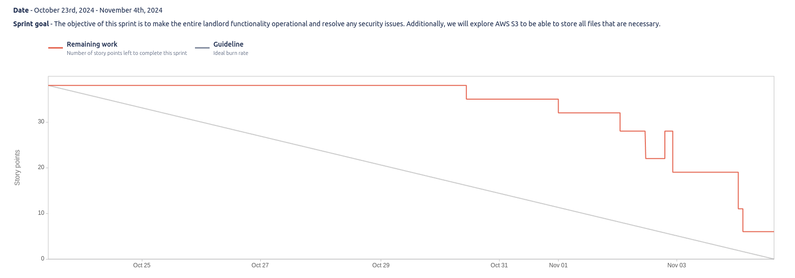

# Sprint 2

**From**: 2024/10/22
**To**: 2024/11/04

**Scrum Master**: Mariana Perna

**Product Owner**: Roberto Castro

**Developers**: Tiago Gomes, Sara Almeida

## Sprint Goal

The objective of this sprint is to make the entire landlord functionality operational and resolve any security issues. Additionally, we will explore AWS S3 to be able to store all files that are necessary.

| Expected     | Quantity |
| ------------ | -------- |
| Tasks        | 24       |
| Epics        | 2        |
| Story Points | 35       |

## Sprint Backlog

| Taks (SCRUM-\*)  | Description                                   | Developer          | State | 
| ---------------  | --------------------------------------------- | ---------------    | ----- | 
| SCRUM-82         | Addition of Expenses - API/Database           | Roberto Castro     | Done  |
| SCRUM-105        | Addition of Expenses - Frontend               | Sara Almeida       | Done  |
| SCRUM-106        | Addition of Expenses - Integration            | Roberto Castro     | Done  |
| SCRUM-86         | Addition of Expenses - Testing                | Sara Almeida       | Done  |
| SCRUM-55         | Pending Payments - API/Database               | Sara Almeida       | Done  |
| SCRUM-57         | Pending Payments - Frontend                   | Sara Almeida       | Done  |
| SCRUM-59         | Pending Payments - Testing                    | Sara Almeida       | Done  |
| SCRUM-17         | Landing Page - Testing                        | Sara Almeida       | Done  |
| SCRUM-95         | Create Houses - API/Database                  | Mariana Perna      | Done  |
| SCRUM-100        | Create Houses - Frontend                      | Tiago Gomes        | Done  |
| SCRUM-96         | Create Houses - Testing                       | Tiago Gomes        | Done  |
| SCRUM-76         | Document History - API/Database               | Sara Almeida       | Done  |
| SCRUM-78         | Document History - Sort/Filter                | Sara Almeida       | Done  |
| SCRUM-79         | Document History - S3 metadata storage        | Roberto Castro     | Done  |
| SCRUM-80         | Document History - Testing                    | Tiago Gomes        | Done  |
| SCRUM-104        | Document History - Frontend                   | Roberto Castro     | Done  |
| SCRUM-98         | Add Tenants to House - API/DATABASE           | Mariana Perna      | Done  |
| SCRUM-99         | Add Tenants to House - Testing                | Tiago Gomes        | Done  |
| SCRUM-101        | Add Tenants to House - Frontend               | Roberto Castro     | Done  |
| SCRUM-107        | Message broker configure users                | Mariana Perna      | Done  |
| SCRUM-60         | Token logic (jwt client secret not exposed)   | Tiago Gomes        | Done  |
| SCRUM-93         | Refactor of the acceptance test               | Sara Almeida       | Done  |
| SCRUM-108        | Message broker configure landlords            | Mariana Perna      | Done  |
| SCRUM-26         | Deploy Landord Microservice in AWS ECS        | Mariana Perna      | Done  |

## User Stories

| User Stories  | Description                    | Developer     | State | Story Points |
| --------------| ------------------------------ | ------------- | ----- | ------------ |
| SCRUM-11      | Landlord Addition of Expenses  | All           | Done  | 9            |
| SCRUM-6       | Management of Pending Payments | All           | Done  | 5            |
| SCRUM-15      | Landlord Landing Page          | All           | Done  | 3            |
| SCRUM-94      | Create Houses                  | All           | Done  | 4            |
| SCRUM-28      | Landlord View Document History | All           | Done  | 6            |
| SCRUM-97      | Add tenants to house           | All           | Done  | 8            |

## Sprint Review

| Concluded    | Quantity |
| ------------ | -------- |
| Tasks        | 24       |
| Epics        | 1        |
| Story Points | 35       |

## Sprint Retrospective

Despite the unexpected departure of a team member, we managed to successfully achieve our sprint objectives. Although we faced several challenges and experienced an increased workload, the team adapted well, showing resilience and dedication to meet our goals.

## Sprint Burndown Chart

