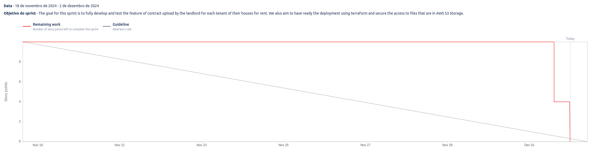

# Sprint 5

**From**: 2024/12/05
**To**: 2024/12/16

**Scrum Master**: Sara Almeida

**Product Owner**: Tiago Gomes

**Developers**: MAriana Perna, Roberto Castro

## Sprint Goal

The goal for this sprint is to create a page for the tenants to be able to submit an issue and another page, on the landlord side, where they can see all the issues submitted by the tenants.

| Expected     | Quantity |
| ------------ | -------- |
| Stories      | 3        |
| Tasks        | 0        |
| Epics        | 2        |
| Story Points | 12       |

## Sprint Backlog

| Tasks (SCRUM-\*) | Description                                  | Assignee          | State | 
| ---------------  | --------------------------------------------- | ---------------    | ----- | 
| SCRUM-14         | Tenant Landing Page               | -      | To-Do  |
| SCRUM-33         | Submit an Issue    | Sara Almeida       | To-Do  |
| SCRUM-35         | View All Reported Issues        | Mariana Perna     | To-Do  |

## User Stories

| User Stories  | Description                    | Developer     | State | Story Points |
| --------------| ------------------------------ | ------------- | ----- | ------------ |
| SCRUM-14         | Tenant Landing Page               | -      | To-Do  | 5            |
| SCRUM-33         | Submit an Issue    | Sara Almeida       | To-Do  | 4            |
| SCRUM-35         | View All Reported Issues        | Mariana Perna     | To-Do  | 3            |

## Sprint Review

| Concluded    | Quantity |
| ------------ | -------- |
| Stories      | 0        |
| Tasks        | 0        |
| Epics        | 0        |
| Story Points | 0        |

## Sprint Retrospective

For this sprint, we planed to start the development of the tenant side of the application. We were not able to complete any of the stories planned for this sprint. The team faced the big challenge of lack of time due to other university projects and unplanned problems that came from these last mentioned ones. We will catch up on the next sprint and we are very confident that we will be able to deliver the stories planned for this sprint.

## Sprint Burndown Chart

