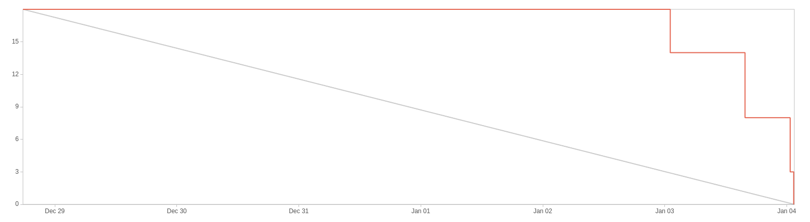

# Sprint 6

**From**: 2024/12/28
**To**: 2025/01/04

**Scrum Master**: Mariana Perna

**Product Owner**: Roberto Castro

**Developers**: Sara Almeida, Tiago Gomes

## Sprint Goal

The goal for this sprint is to complete the inviting tenants logic, the issues submission and visualization functionalities and finalize the tenant dashboard. We have to implement the functionality of email notifications sending so it is possible to invite tenants. We will also complete the submit an issue functionality and the visualization of all the issues by the landlors. Finally, we will finish the tenant dashboard to show the expenses and issues for each house they have renting.

| Expected     | Quantity |
| ------------ | -------- |
| Stories      | 4        |
| Tasks        | 2        |
| Bug          | 1        |
| Epics        | 2        |
| Story Points | 18       |

## Sprint Backlog

| Issues (SCRUM-\*)| Description                                  | Assignee          | State | 
| ---------------  | --------------------------------------------- | ---------------    | ----- | 
| SCRUM-14         | Tenant Landing Page               | Sara Almeida      | Done  |
| SCRUM-33         | Submit an Issue    | Roberto Castro       | Done  |
| SCRUM-35         | View All Reported Issues        | Mariana Perna     | Done  |
| SCRUM-119        | Notification Microservice Setup        | Tiago Gomes     | Done  |
| SCRUM-120         | Inviting Tenant        | Tiago Gomes     | Done  |
| SCRUM-103         | CD Pipeline        | Mariana Perna     | In progress  |
| SCRUM-134         | Fix Tenant Role in User Microservice        | Roberto Castro     | Done  |

## User Stories

| User Stories  | Description                    | Developer     | State | Story Points |
| --------------| ------------------------------ | ------------- | ----- | ------------ |
| SCRUM-14         | Tenant Landing Page               | Sara Almeida      | Done  | 5 |
| SCRUM-33         | Submit an Issue    | Roberto Castro       | Done  | 4 |
| SCRUM-35         | View All Reported Issues        | Mariana Perna     | Done  | 3 |
| SCRUM-120         | Inviting Tenant        | Tiago Gomes     | Done  | 6 |

## Sprint Review

| Concluded    | Quantity |
| ------------ | -------- |
| Stories      | 4        |
| Tasks        | 1        |
| Bug          | 1        |
| Epics        | 2        |
| Story Points | 18       |

## Sprint Retrospective

We were able to successfully meet the sprint goal by completing the inviting tenants logic, the issues submission and visualization functionalities, and finalizing the tenant dashboard. The team worked collaboratively to address the tasks and user stories, ensuring that all features were implemented according to the acceptance criteria. Additionally, the bug related to the tenant role in the user microservice was fixed. We still need to improve our CD Pipeline has we are having some problems with the deployment of the services which will be a focus for the next sprint.

## Sprint Burndown Chart

